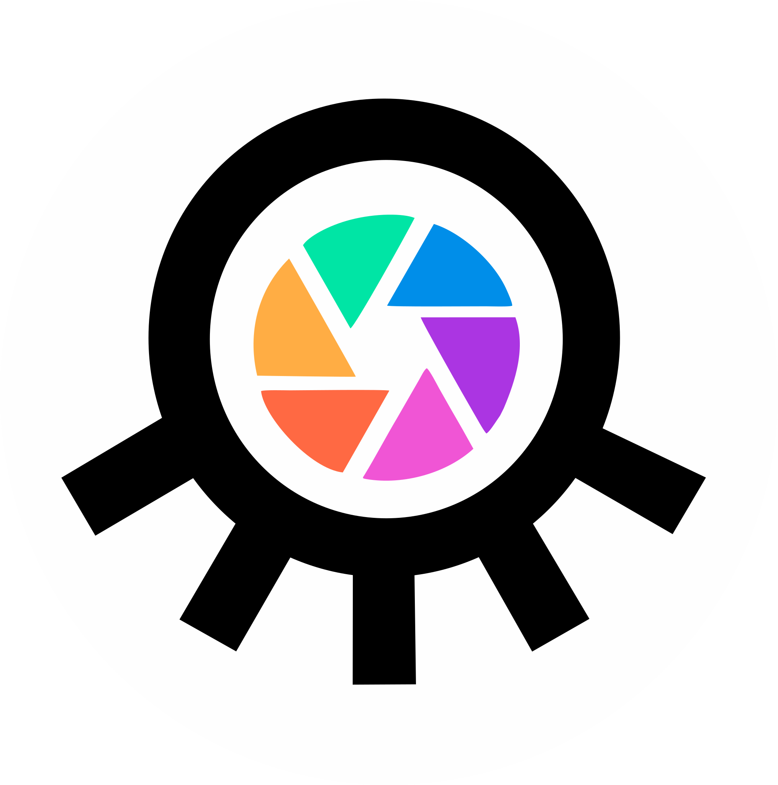

<h1 align="center">KOROVA DIGITA - WEBSITE</h1>

<p align="center">
    
    <a href="https://octosoftprofessionals.com/"></a>
  </a>
  <h3 align="center">KOROVA DIGITA - OCTOSOFT</h3>
  <p align="center">
   An amazing page to view, with the use of <strong><a href="https://www.gatsbyjs.com/">Gatsby</a></strong> which is connected to <strong><a href="https://www.contentful.com/why-contentful/" >Contentful</a></strong> !
    <br />
    <a href="https://github.com/obsidian-software-service/korova-website"><strong>Explore the docs »</strong></a>
    <br />
    <br />
  </p>
</p>
<br />
<p>This is a test project for the App where you can see the functioning of a responsive page using technologies such as React, Material-ui and others.</p>

<p align="center">
    
    
</p>
<hr>
<br />

<h1>How to run this project locally</h1>

1. Clone this repo:
```sh
    git clone https://github.com/obsidian-software-service/korova-website.git
```
2. Navigate to the "**korova-website**" folder:
```sh
    cd korova-website
```
3. Delete file called **package-lock.json**
4. Run ``` npm install ```
5. Add a file ``` .evn.production ``` 
```
    CONTENTFUL_SPACE_ID=<Your Contentful appId>
    CONTENTFUL_ACCESS_TOKEN=<Your Contentful apiKey>
```
1. Run ``` npm run start ```
2. Open [http://localhost:8000](http://localhost:8000) to view it in the browser.
<br>
<hr>